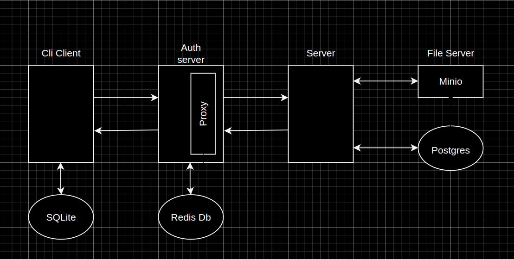

# GophKeeper - Общая информация

Проект состоит из 4 микросервисов:

- CliClient
- AuthServer
- KeepServer
- FileServer

Общая схема взаимодействия

## CliClient
Консольный интерфейс для взаимодействия с приложением.

Есть временное локальное хранилище данных(SQLite). Служит для хранения запросов, в случае когда не доступен AuthServer.

Для безопасности взаимодействие с AuthServer происходит через jwt token. Время работы access и refresh токенов задается в конфиге.

## AuthServer
Сервер авторизации и аутентификации клиента

Во временном хранилище лежат токены.

После проверки токенов проксирует запросы в keepServer

Хотел сделать service mesh для kubernetes, но видимо уже не успею

## KeepServer
Основной сервер для работы с данными

Данные хранятся в Postgres(хотелось бы взять монгу например, но я итак профукал все сроки)

Файлы отправляются в FileServer

## FileServer
Сервер хранения файлов.

Сделан на основе minio. Совместим с любым s3 хранилищем